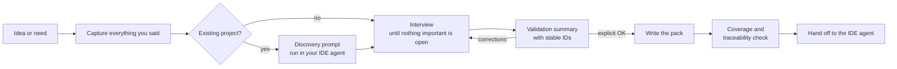

# Handoff Pack

**Plan in the chat. Build in the IDE. Lose nothing in between.**

[](LICENSE)
[](https://agentskills.io)


Handoff Pack is an [Agent Skill](https://agentskills.io) that turns an idea, a need, or an existing project into a **validated, agent-ready documentation pack**. It interviews you until every important detail is settled, asks for your explicit approval, and only then writes a set of Markdown files that any coding agent in your IDE (Claude Code, GitHub Copilot agent mode, Cursor and others) can read and execute from step one.

The skill interviews you and writes the pack in your own language.

---

## Table of contents

- [The problem](#the-problem)
- [Who it is for](#who-it-is-for)
- [Use cases](#use-cases)
- [How it works](#how-it-works)
- [What you get](#what-you-get)
- [Installation](#installation)
- [Usage](#usage)
- [Design principles](#design-principles)
- [How it compares](#how-it-compares)
- [Repository structure](#repository-structure)
- [Roadmap](#roadmap)
- [Contributing](#contributing)
- [License](#license)

---

## The problem

Many people and teams think in one place and build in another:

- **Thinking happens in a chat** (Claude on the web or desktop): exploring the idea, weighing options, clarifying requirements.
- **Building happens in the IDE**: Claude Code, GitHub Copilot or Cursor working directly on the repository.

The agent in the IDE never sees that conversation. Whatever is not written down does not exist for it, so it fills the gaps with guesses: the wrong stack version, a forgotten edge case, a decision you already discarded. Copy-pasting chunks of the chat does not fix this; the important nuances are usually the ones that get lost.

Handoff Pack closes that gap with a structured, verified handoff.

## Who it is for

**Primary audience**

- **Developers and tech leads** who plan in Claude's web or desktop app and implement with an agent in VS Code or another IDE.
- **Teams in companies that standardize on GitHub Copilot or Claude Code** for implementation but use a chat assistant for analysis and design, and need a reliable bridge between the two.
- **Product managers, founders and domain experts** who define *what* to build and hand it off to engineers who work with coding agents.
- **Freelancers and consultants** who onboard an agent to a client's existing codebase and need a clear brief before touching it.

**Also useful for**

- Anyone who wants a written, reviewable spec instead of a long prompt.
- Teams that want a consistent handoff format across projects and tools.

**Probably not for you if**

- The change is a one-line fix or a small, obvious task. The interview would be overkill.
- You want a fully autonomous pipeline with no human decisions. This skill is deliberately human-in-the-loop.
- You already run a complete spec-driven framework end to end and are happy with it. Handoff Pack can still feed it, but it does not replace it.

## Use cases

| Scenario | What Handoff Pack does |
|---|---|
| **New project from an idea** | Interviews you about goals, scope, data, edge cases and constraints, then produces context, architecture, requirements and a phased action plan. |
| **New feature in an existing repo** | Gives you a read-only discovery prompt to run in your IDE agent, uses its report as verified facts (including the closest existing feature to imitate and the code to reuse), and plans the feature around the real codebase. |
| **Refactor or migration** | Captures what must not change, compatibility constraints and untouchable areas, and splits the work into small, verifiable tasks. |
| **Complex bug or incident fix** | Records context, reproduction steps, expected behavior and verification commands so the agent does not "fix" the wrong thing. |
| **Onboarding an agent to a legacy project** | Documents conventions, structure and agent rules in a pack the agent reads automatically. |
| **Meeting notes or a rough brief to an executable plan** | Turns scattered notes into requirements with acceptance criteria and ordered tasks, after confirming every gap with you. |

## How it works



1. **Capture.** Every statement you make (goals, names, numbers, "must" and "must not") is inventoried so nothing is paraphrased away.
2. **Discovery (existing projects).** The skill cannot see your repository from a chat, and it will not guess. It gives you a read-only prompt to run in your IDE agent; the report becomes the factual base.
3. **Interview.** Short rounds of non-obvious questions guided by a 15-area checklist: scope, flows, data, edge cases, errors, security, integrations, technical constraints, testing, deployment, untouchable code, priorities, definition of done and how the agent should behave.
4. **Validation gate.** Before writing any file, the skill shows a compact summary using the same IDs the files will use (`RF-03`, `D-02`, `T-05`), so you can say "change RF-03". Nothing is written without your explicit OK.
5. **Write and verify.** The pack is written from templates and checked for coverage, traceability, consistency and zero invented facts.
6. **Hand off.** You drop the files into your repo and paste the ready-made kickoff prompt into your agent.

## What you get

```text
your-repo/
├── AGENTS.md                  # Short pointer agents read automatically
└── handoff/
    ├── README.md              # Reading order, agent rules, kickoff prompts
    ├── 01-CONTEXT.md          # Problem, users, goals, non-goals, decisions, glossary
    ├── 02-ARCHITECTURE.md     # Stack, structure, components, data, integrations
    ├── 03-REQUIREMENTS.md     # Functional and non-functional requirements + acceptance criteria
    ├── 04-ACTION-PLAN.md      # Phased, self-contained tasks, progress log, traceability
    └── 05-PENDING.md          # Delegated decisions, external blockers, risks
```

Every item carries a status:

| Status | Meaning |
|---|---|
| ✅ Confirmed | Validated by you or verified in the repository. |
| 🔶 Delegated | You explicitly allowed the agent to decide, within stated limits. |
| ❓ Pending | Depends on external information; owner and blocked tasks are listed. |

There is no "assumed" status. If something important is unknown, the skill asks.

`AGENTS.md` can also be copied as `CLAUDE.md` or `.github/copilot-instructions.md` if your tool prefers those files.

## Installation

### Claude (web and desktop)

1. Download `handoff-pack.zip` from the [latest release](../../releases/latest), or build it yourself with `./scripts/build-zip.sh`.
2. Make sure code execution is enabled in your Claude settings.
3. In the Skills section, choose **Create skill → Upload a skill** and select the ZIP.

The exact menu may change; see Anthropic's guide [Use skills in Claude](https://support.claude.com/en/articles/12512180-use-skills-in-claude) if it looks different. Custom skills you upload are private to your account.

### Claude Code (plugin marketplace)

```text
/plugin marketplace add SergVina/Handoff-pack-skill
/plugin install handoff-pack@handoff-pack
```

### Claude Code (manual)

Copy the skill folder into your personal or project skills directory:

```bash
# Personal (all projects)
cp -r skills/handoff-pack ~/.claude/skills/

# Project only
cp -r skills/handoff-pack .claude/skills/
```

### Other agents (skills CLI)

```bash
npx skills add SergVina/Handoff-pack-skill
```

The generated pack itself needs no installation: it is plain Markdown that any agent can read.

## Usage

Just describe what you want to build or change. The skill activates on requests such as:

- "Prepare the documentation so Copilot can build this."
- "I want to hand this idea to Claude Code without losing anything."
- "Write a detailed action plan for adding SSO to our existing app."
- "Prepárame el traspaso para el agente de VS Code."

Then:

1. Answer the interview rounds (most questions come with options and a recommended choice).
2. Review the validation summary and approve it or correct it.
3. Download the pack, unzip it at the root of your repository and paste the kickoff prompt from `handoff/README.md` into your agent.

## Design principles

- **Zero silent assumptions.** Unknowns are asked, delegated with your approval, or explicitly marked as blocked. Never guessed.
- **Human approval before output.** The validation gate is mandatory.
- **Lossless capture.** Names, numbers and constraints are kept verbatim and checked for coverage at the end.
- **Traceability.** Every requirement maps to tasks and every task cites requirements.
- **Executable tasks.** Each task fits in one agent session and has verifiable acceptance criteria and a concrete way to check them.
- **Tool-agnostic output.** Plain Markdown, no HTML or images, diagrams in Mermaid or ASCII. Works with Claude Code, Copilot, Cursor and any agent that reads files.
- **No invented facts.** Versions, endpoints and repository structure appear only when you or the repository provided them.

## How it compares

Interview-first spec writing is a well-established pattern, and several good tools exist:

- **[GitHub Spec Kit](https://github.com/github/spec-kit)** is a full spec-driven development toolkit with a CLI and a constitution → specify → plan → tasks → implement workflow inside your agent.
- **Interview skills for Claude Code**, such as [interview-me](https://github.com/sorbh/interview-me) and [claude-spec-plugin](https://github.com/ashikshafi08/claude-spec-plugin), run the interview inside Claude Code and write a spec file.
- Claude Code's own [best practices](https://code.claude.com/docs/en/best-practices) recommend letting Claude interview you before writing a spec.

Handoff Pack focuses on a specific gap: **the bridge between a chat assistant and an IDE agent**. It is designed to run where planning happens (Claude on the web or desktop), to produce a multi-file pack with an action plan and kickoff prompts for any agent, to support existing codebases through a discovery prompt, and to enforce a validation gate and a coverage check before handing off.

## Repository structure

```text
handoff-pack/
├── .claude-plugin/
│   └── marketplace.json         # Claude Code marketplace manifest
├── .github/workflows/
│   └── release.yml              # Builds and attaches the ZIP on each release
├── skills/
│   └── handoff-pack/
│       ├── SKILL.md             # Workflow and rules
│       └── references/
│           ├── interview-checklist.md
│           ├── templates.md
│           └── discovery-prompt.md
├── scripts/
│   └── build-zip.sh             # Builds dist/handoff-pack.zip for Claude uploads
├── CHANGELOG.md
├── CONTRIBUTING.md
└── LICENSE
```

## Roadmap

- A worked example pack in `examples/` showing a full interview and its output.
- Optional lightweight mode for small changes.
- Pack update mode: revise an existing `handoff/` after new decisions without regenerating everything.
- Evaluation set to test triggering and output quality across releases.

Ideas and feedback are welcome in [issues](../../issues).

## Contributing

Contributions are welcome. See [CONTRIBUTING.md](CONTRIBUTING.md).

## License

[MIT](LICENSE)
