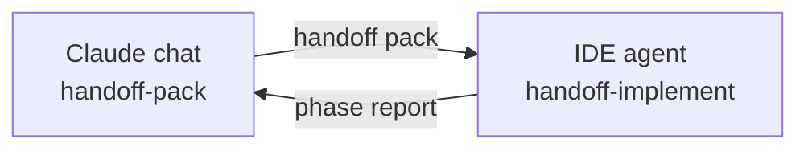
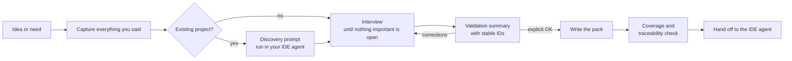
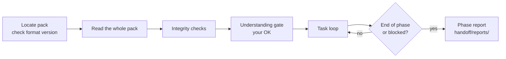

# Handoff Pack

**Plan in the chat. Build in the IDE. Lose nothing in between.**

[](LICENSE)
[](https://agentskills.io)


Handoff Pack is a pair of [Agent Skills](https://agentskills.io) that carry a project from the chat where you plan it to the IDE where an agent builds it, and back:

| Skill | Where it runs | What it does |
|---|---|---|
| **`handoff-pack`** | Claude chat (web or desktop) | Interviews you until every important detail is settled, asks for your explicit approval, and only then writes a **validated, agent-ready Markdown pack**. Also updates the pack from the agent's reports. |
| **`handoff-implement`** | Your IDE agent (Claude Code, GitHub Copilot agent mode, Cursor and others) | Reads the pack, checks its integrity, confirms its understanding with you, implements one task at a time within the limits you set, and writes phase reports in the exact format `handoff-pack` needs to update the pack. |

Both talk to you and write in your own language. The pack is plain Markdown and works with any coding agent **even without `handoff-implement`**: the `AGENTS.md` file it ships carries the basic working rules. The second skill adds rigor on the IDE side.

---

## Table of contents

- [The problem](#the-problem)
- [Who it is for](#who-it-is-for)
- [Use cases](#use-cases)
- [The full cycle](#the-full-cycle)
- [How it works](#how-it-works)
- [How handoff-implement works](#how-handoff-implement-works)
- [What you get](#what-you-get)
- [Installation](#installation)
- [Usage](#usage)
- [Design principles](#design-principles)
- [How it compares](#how-it-compares)
- [Repository structure](#repository-structure)
- [Roadmap](#roadmap)
- [Contributing](#contributing)
- [License](#license)

---

## The problem

Many people and teams think in one place and build in another:

- **Thinking happens in a chat** (Claude on the web or desktop): exploring the idea, weighing options, clarifying requirements.
- **Building happens in the IDE**: Claude Code, GitHub Copilot or Cursor working directly on the repository.

The agent in the IDE never sees that conversation. Whatever is not written down does not exist for it, so it fills the gaps with guesses: the wrong stack version, a forgotten edge case, a decision you already discarded. Copy-pasting chunks of the chat does not fix this; the important nuances are usually the ones that get lost.

Handoff Pack closes that gap with a structured, verified handoff.

## Who it is for

**Primary audience**

- **Developers and tech leads** who plan in Claude's web or desktop app and implement with an agent in VS Code or another IDE.
- **Teams in companies that standardize on GitHub Copilot or Claude Code** for implementation but use a chat assistant for analysis and design, and need a reliable bridge between the two.
- **Product managers, founders and domain experts** who define *what* to build and hand it off to engineers who work with coding agents.
- **Freelancers and consultants** who onboard an agent to a client's existing codebase and need a clear brief before touching it.

**Also useful for**

- Anyone who wants a written, reviewable spec instead of a long prompt.
- Teams that want a consistent handoff format across projects and tools.

**Probably not for you if**

- The change is a one-line fix or a small, obvious task. The interview would be overkill.
- You want a fully autonomous pipeline with no human decisions. This skill is deliberately human-in-the-loop.
- You already run a complete spec-driven framework end to end and are happy with it. Handoff Pack can still feed it, but it does not replace it.

## Use cases

| Scenario | What Handoff Pack does |
|---|---|
| **New project from an idea** | Interviews you about goals, scope, data, edge cases and constraints, then produces context, architecture, requirements and a phased action plan. |
| **New feature in an existing repo** | Gives you a read-only discovery prompt to run in your IDE agent, uses its report as verified facts (including the closest existing feature to imitate and the code to reuse), and plans the feature around the real codebase. |
| **Refactor or migration** | Captures what must not change, compatibility constraints and untouchable areas, and splits the work into small, verifiable tasks. |
| **Complex bug or incident fix** | Records context, reproduction steps, expected behavior and verification commands so the agent does not "fix" the wrong thing. |
| **Onboarding an agent to a legacy project** | Documents conventions, structure and agent rules in a pack the agent reads automatically. |
| **Meeting notes or a rough brief to an executable plan** | Turns scattered notes into requirements with acceptance criteria and ordered tasks, after confirming every gap with you. |

## The full cycle



1. In the chat, `handoff-pack` interviews you and writes the pack.
2. In the IDE, `handoff-implement` reads it, validates it and executes the tasks one by one.
3. At the end of each phase, it writes a report in `handoff/reports/`, in the exact format that `handoff-pack`'s Update mode expects.
4. You take the report back to the chat, and `handoff-pack` updates the pack after you confirm each change.

Both skills follow the same **pack format contract**, [`spec/PACK-FORMAT.md`](spec/PACK-FORMAT.md) (format 1): files, IDs, statuses, sources, required sections, task cards and the report. Each skill ships an identical copy, so each one works on its own.

## How it works



1. **Capture.** Every statement you make (goals, names, numbers, "must" and "must not") is inventoried so nothing is paraphrased away.
2. **Discovery (existing projects).** The skill cannot see your repository from a chat, and it will not guess. It gives you a read-only prompt to run in your IDE agent; the report becomes the factual base.
3. **Interview.** Short rounds of non-obvious questions guided by a 15-area checklist: scope, flows, data, edge cases, errors, security, integrations, technical constraints, testing, deployment, untouchable code, priorities, definition of done and how the agent should behave.
4. **Validation gate.** Before writing any file, the skill shows a compact summary using the same IDs the files will use (`RF-03`, `D-02`, `T-05`), so you can say "change RF-03". Nothing is written without your explicit OK.
5. **Write and verify.** The pack is written from templates and checked for coverage, traceability, consistency and zero invented facts.
6. **Hand off.** You drop the files into your repo and paste the ready-made kickoff prompt into your agent.

Besides the full pack, `handoff-pack` has a **Lite** mode (a single `handoff/HANDOFF.md` for a contained change) and an **Update** mode (revise an existing pack from an agent report or a new decision, keeping IDs and history). For people who do not code, it interviews in plain language and adds a `00-START-HERE.md` guide.

## How handoff-implement works



1. **Startup.** Finds `handoff/README.md` (Full) or `handoff/HANDOFF.md` (Lite), checks the `Pack format` line, and reads everything in the pack's reading order. If there is no pack, it sends you to `handoff-pack` instead of improvising a plan.
2. **Integrity checks.** Duplicate IDs, references to IDs that do not exist, requirements without tasks, tasks without requirements, cards without acceptance criteria or a way to verify, ❓ items blocking the next task, contradictions between files and between the pack and the code.
3. **Understanding gate.** A summary of what it will build (10 lines at most), the problems found and the doubts that block the next task. No code until you say OK.
4. **Task loop.** Pre-check (dependencies done, nothing ❓ blocking), a short technical plan, implementation within the card's scope, literal verification of every acceptance criterion, and a progress log entry.
5. **Hard limits.** It never changes your decisions (`D-xx`) or requirements (`RF`/`RNF`), decides 🔶 items only within their written limits, stops and asks on anything not delegated, reports contradictions instead of "fixing" the pack, and never expands the scope. With a non-technical owner it explains results in plain language and asks before anything that costs money, creates accounts or deletes data.
6. **Phase report.** `handoff/reports/phase-<N>-<YYYY-MM-DD>.md` with nine fixed sections, always declaring decisions that were not delegated.

## What you get

```text
your-repo/
├── AGENTS.md                  # Short pointer and working rules agents read automatically
├── CLAUDE.md                  # Only if you use Claude Code: imports AGENTS.md
└── handoff/
    ├── 00-START-HERE.md       # Only for non-technical owners: plain-language guide
    ├── README.md              # Pack format, reading order, agent rules, kickoff prompts, history
    ├── 01-CONTEXT.md          # Problem, users, goals, constraints, decisions, glossary, statement inventory
    ├── 02-ARCHITECTURE.md     # Stack, current and target state, components, data, integrations
    ├── 03-REQUIREMENTS.md     # Functional and non-functional requirements, edge cases
    ├── 04-ACTION-PLAN.md      # Phased, self-contained tasks, progress, traceability, progress log
    ├── 05-PENDING.md          # Delegated decisions, external blockers, risks
    └── reports/               # Phase reports written by the agent
```

In Lite mode, `handoff/` holds a single `HANDOFF.md` plus `reports/`.

Every item carries a status:

| Status | Meaning |
|---|---|
| ✅ Confirmed | Validated by you or verified in the repository. |
| 🔶 Delegated | You explicitly allowed the agent to decide, within stated limits. |
| ❓ Pending | Depends on external information; owner and blocked tasks are listed. |

There is no "assumed" status. If something important is unknown, the skill asks.

`AGENTS.md` is read natively by Copilot, Cursor and most agents. Claude Code reads `CLAUDE.md`, so the pack adds one whose first line, `@AGENTS.md`, imports the same rules. Existing agent files are never overwritten.

## Installation

What goes where:

| Skill | Install it in | Required? |
|---|---|---|
| `handoff-pack` | Claude (web or desktop), where you plan | Yes: it creates and updates the pack |
| `handoff-implement` | Your IDE agent, where the code is written | Optional but recommended; without it the pack still works through `AGENTS.md` |

Each release has one ZIP per skill: `handoff-pack-<version>.zip` and `handoff-implement-<version>.zip`. You can also build them with `./scripts/build-zip.sh` (output in `dist/`).

### `handoff-pack` in Claude (web and desktop)

1. Download `handoff-pack-<version>.zip` from the [latest release](../../releases/latest).
2. Make sure code execution is enabled in your Claude settings.
3. In the Skills section, choose **Create skill → Upload a skill** and select the ZIP.

The exact menu may change; see Anthropic's guide [Use skills in Claude](https://support.claude.com/en/articles/12512180-use-skills-in-claude) if it looks different. Custom skills you upload are private to your account.

### `handoff-implement` in Claude Code (plugin marketplace)

The plugin installs both skills. In Claude Code you will mostly use `handoff-implement`; `handoff-pack` stays available to plan or update a pack inside the repository.

```text
/plugin marketplace add SergVina/Handoff-pack-skill
/plugin install handoff-pack@handoff-pack
```

### `handoff-implement` in Claude Code (manual)

Copy the skill folder into your personal or project skills directory:

```bash
# Personal (all projects)
cp -r skills/handoff-implement ~/.claude/skills/

# Project only
cp -r skills/handoff-implement .claude/skills/
```

### Other agents (skills CLI)

For Copilot, Cursor and other agents that support Agent Skills:

```bash
npx skills add SergVina/Handoff-pack-skill
```

Or copy `skills/handoff-implement` into the skills directory your agent documents.

The generated pack itself needs no installation: it is plain Markdown that any agent can read.

## Usage

Just describe what you want to build or change. The skill activates on requests such as:

- "Prepare the documentation so Copilot can build this."
- "I want to hand this idea to Claude Code without losing anything."
- "Write a detailed action plan for adding SSO to our existing app."
- "Prepárame el traspaso para el agente de VS Code."

Then:

1. Answer the interview rounds (most questions come with options and a recommended choice).
2. Review the validation summary and approve it or correct it.
3. Download the pack, unzip it at the root of your repository and paste the kickoff prompt from `handoff/README.md` into your agent.

In the IDE, with `handoff-implement` installed, say things like:

- "Start the handoff." / "Empieza con el traspaso."
- "Next task." / "Haz la siguiente tarea."
- "Implement T-03."
- "Write the phase report." / "Escribe el informe de fase."

Take each phase report back to the Claude chat and ask to update the pack. That keeps the pack the single source of truth.

## Design principles

- **Zero silent assumptions.** Unknowns are asked, delegated with your approval, or explicitly marked as blocked. Never guessed.
- **Human approval before output.** The validation gate is mandatory.
- **Lossless capture.** Names, numbers and constraints are kept verbatim and checked for coverage at the end.
- **Traceability.** Every requirement maps to tasks and every task cites requirements.
- **Executable tasks.** Each task fits in one agent session and has verifiable acceptance criteria and a concrete way to check them.
- **Tool-agnostic output.** Plain Markdown, no HTML or images, diagrams in Mermaid or ASCII. Works with Claude Code, Copilot, Cursor and any agent that reads files.
- **No invented facts.** Versions, endpoints and repository structure appear only when you or the repository provided them.
- **One contract, two sides.** The writer and the reader of the pack follow the same versioned format, so a pack written in Spanish today is read correctly by an agent next month.

## How it compares

Interview-first spec writing is a well-established pattern, and several good tools exist:

- **[GitHub Spec Kit](https://github.com/github/spec-kit)** is a full spec-driven development toolkit with a CLI and a constitution → specify → plan → tasks → implement workflow inside your agent.
- **Interview skills for Claude Code**, such as [interview-me](https://github.com/sorbh/interview-me) and [claude-spec-plugin](https://github.com/ashikshafi08/claude-spec-plugin), run the interview inside Claude Code and write a spec file.
- Claude Code's own [best practices](https://code.claude.com/docs/en/best-practices) recommend letting Claude interview you before writing a spec.

Handoff Pack focuses on a specific gap: **the bridge between a chat assistant and an IDE agent**. It is designed to run where planning happens (Claude on the web or desktop), to produce a multi-file pack with an action plan and kickoff prompts for any agent, to support existing codebases through a discovery prompt, and to enforce a validation gate and a coverage check before handing off.

## Repository structure

```text
handoff-pack/
├── .claude-plugin/
│   └── marketplace.json         # Claude Code marketplace manifest (both skills)
├── .github/
│   ├── ISSUE_TEMPLATE/          # Bug report and feature request templates
│   ├── PULL_REQUEST_TEMPLATE.md
│   └── workflows/
│       ├── checks.yml           # Format sync, validation and ZIP build on every push and PR
│       └── release.yml          # Builds and attaches both ZIPs on each release
├── spec/
│   └── PACK-FORMAT.md           # Canonical pack format contract (format 1)
├── skills/
│   ├── handoff-pack/            # Chat side: interview, validate, write and update the pack
│   │   ├── SKILL.md
│   │   └── references/
│   │       ├── pack-format.md   # Copy of spec/PACK-FORMAT.md
│   │       ├── interview-checklist.md
│   │       ├── templates.md
│   │       ├── lite-mode.md
│   │       ├── update-mode.md
│   │       ├── feedback-prompt.md
│   │       ├── agent-files.md
│   │       ├── discovery-prompt.md
│   │       ├── non-technical-users.md
│   │       └── project-types/   # Lenses: frontend, api, data, migration, website, automation
│   └── handoff-implement/       # IDE side: validate and execute the pack, report back
│       ├── SKILL.md
│       └── references/
│           ├── pack-format.md   # Copy of spec/PACK-FORMAT.md
│           ├── integrity-checks.md
│           ├── task-loop.md
│           └── report-template.md
├── evals/
│   ├── handoff-pack/            # evals.json and trigger-evals.json
│   └── handoff-implement/       # evals.json and trigger-evals.json
├── scripts/
│   ├── build-zip.sh             # Builds one versioned ZIP per skill in dist/
│   ├── check-format-sync.sh     # Fails if a skill's copy of the contract differs
│   └── validate.sh              # Frontmatter, versions, cited references, JSON, evals paths
├── CHANGELOG.md
├── CONTRIBUTING.md
└── LICENSE
```

## Roadmap

- A worked example: a full interview, its pack, an implementation phase and the report going back.
- Run the evaluation sets automatically on each release and publish the results.
- More project lenses (mobile apps, browser extensions, games).
- A pack linter that runs the `handoff-implement` integrity checks as a script, for CI in the user's repository.

Ideas and feedback are welcome in [issues](../../issues).

## Contributing

Contributions are welcome. See [CONTRIBUTING.md](CONTRIBUTING.md).

## License

[MIT](LICENSE)
